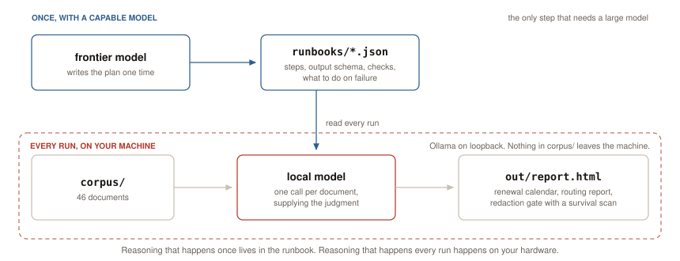

<div align="center">

# understudy

**Define the work once with a capable model. Do the work repeatedly with a small one, on your own machine.**

*My experiments with local LLMs. A measured record, not a working tool.*

[](https://github.com/namanrajpal/understudy/actions/workflows/validate.yml)


<picture>
  <source media="(prefers-color-scheme: dark)" srcset="docs/charts/architecture-dark.svg">
  
</picture>

[Read the write-up](docs/POST.md) · [Results](docs/RESULTS.md) · [Findings](docs/FINDINGS.md) · [Corpus](docs/CORPUS.md) · [Spec](SPEC.md) · [Output, without installing anything](examples/)

</div>

---

> [!IMPORTANT]
> **This is a repo of experiments, not a working or ready tool.** I built it to
> find out whether small open-weight models are genuinely useful for one shape of
> document work, and to measure where they stop being useful. Everything here is
> experimental: nothing is packaged, hardened, supported, or intended for
> production use, and interfaces change whenever an experiment needs them to.
> Read every number as a measurement of this corpus on this hardware, not as a
> claim about your documents.
>
> Questions, or want to talk about any of it: mail me directly at
> **namanrajpal16@gmail.com**.

## What this is testing

Most document work at a small business is repetitive. The same contracts get read
for renewal dates every quarter. The same inbox gets sorted every morning. The
same intake notes get stripped of personal detail before they go anywhere.

The expensive part of that work is not doing it. It is deciding **how** to do it:
which fields matter, what counts as a valid answer, what to do when a document is
ambiguous. That decision is worth a capable model. Re-deriving it for every
document is not.

So make the decision once, write it down, and commit it. Then run the
writing-down against your documents on your own hardware, as often as you like.

The question here is whether a small local model can carry that second half. Not
whether it can plan the work, and not whether it replaces a frontier model.
Whether it can follow a specification faithfully enough, over and over, that the
output is worth having.

The short answer is yes for some tasks and no for others, and which is which turns
out to be predictable. The rest of this page is the measurement.

## How it works

A frontier model authors a **runbook**: the steps, the output schema, the checks,
and what to do on failure. That happens once and is committed to this repo as
JSON. A small local model then executes that runbook over a folder of documents,
supplying the per-document judgment the runbook cannot contain.

Every model call goes to a local Ollama endpoint on loopback. No document in
`corpus/` leaves the machine it is running on. Every document in `corpus/` is
synthetic: no real person, company, or agreement appears anywhere in this
repository, which is both a privacy requirement and what makes the results
reproducible for anyone who clones it.

## Quick start

```bash
ollama pull gemma4:12b

make validate    # integrity checks. No model, no network.
make all         # contracts, inbox, redact, then rebuild the report
make score       # accuracy against ground truth, per field
```

`make` with no target lists everything. Output lands in `out/report.html`, a
single self-contained page with no CDN.

<details>
<summary>The same thing without <code>make</code>, and the other targets</summary>

```bash
python3 tools/make_corpus.py                       # generate the 46 documents
python3 src/run.py runbooks/triage-contracts.json
python3 src/run.py runbooks/triage-inbox.json
python3 src/run.py runbooks/redact.json --from out/run-latest.json
python3 src/report.py out/run-*.json               # -> out/report.html
```

```bash
make baseline                     # what pattern matching gets instead
make bakeoff                      # every model in the set, over every runbook
MODEL=qwen3.5:4b make contracts   # any single run, against any tag
```

The runner records which model and which machine produced each run.

</details>

## What it runs

Three runbooks over one corpus of 46 synthetic documents:

| Runbook | Work | Output |
|---|---|---|
| `triage-contracts.json` | Read 21 agreements, work out when each actually renews | Renewal calendar |
| `triage-inbox.json` | Read 25 emails, route each to an owner, flag personal data | Routing report |
| `redact.json` | Take whatever either triage flagged and make it safe to send out | Side by side, plus a survival scan |

`redact.json` runs over both corpora. The same redaction spec handles an email
and a lease, and the runner never learns which it is holding.

## Measured results

Five models, 46 documents, temperature 0, seed 7, on an M4 Pro with 48 GB unified
memory. Full provenance and per-field numbers for every model in
[`docs/RESULTS.md`](docs/RESULTS.md); raw run files in [`examples/`](examples/).

| Model | Size | Contracts, 21 docs | Inbox, 25 docs | Redaction gate | tok/s |
|---|---|---|---|---|---|
| `qwen3.8:27b` | 18 GB | **98.0%** | **96.0%** | PASS | 5.0 |
| `muse-glimmer:30b` | 18 GB | 94.6% | **96.0%** | PASS | 6.1 |
| `gemma4:12b` | 7.6 GB | 93.2% | 93.0% | PASS | 12.2 |
| `qwen3.5:9b` | 6.6 GB | 81.0% | 90.0% | PASS | 17.1 |
| `qwen3.5:4b` | 3.4 GB | 74.8% | 91.0% | PASS | 28.1 |

Three things in that table are the point of the whole exercise.

Contract accuracy climbs steeply with size, 74.8% to 98.0%. Inbox accuracy stays
nearly flat, 90.0% to 96.0%, and the 3.4 GB model beats the 6.6 GB one on it.
**Good enough is a property of the task, not of the model.** Read the same numbers
per field and the reason is legible: routing an email is classification into a
short list, while dating a contract renewal is clause reading plus arithmetic.

The redaction gate passes on all five. Removing identifiers turned out not to be
the thing that discriminates between these models at all, which was not the
expectation going in.

Accuracy and speed move in opposite directions, and the fastest model is the least
accurate on the task that needs accuracy. Those tok/s figures are Ollama's own
measurements on one machine, so treat them as the shape of the tradeoff rather
than a number to plan against.

### Where the misses are

`gemma4:12b` is the model to read in detail, because it is the only one in the set
that runs on a single 16 GB consumer GPU. It scores 100% on five of seven contract
fields. All ten of its misses are the same defect on five documents: `renewal_date`
off by exactly one year, and `expires_within_90_days` wrong as a consequence. Those
five are the contracts whose renewal date is not written down and has to be
computed. It classifies all five correctly and slips on the arithmetic.

One row never degrades: `contains_personal_data` is 100% on all five models,
including the 3.4 GB one. That is the field that gates the privacy decision, and it
is the cheapest one to get right.

Per-field tables for every model are in [`docs/RESULTS.md`](docs/RESULTS.md), and
the charts are in [the write-up](docs/POST.md).

<details>
<summary>Why these five models</summary>

| Tag | Lab | Role |
|---|---|---|
| `gemma4:12b` | Google | primary, the only one that fits a 16 GB consumer GPU |
| `qwen3.8:27b` | Alibaba | newest generation, the quality ceiling |
| `muse-glimmer:30b` | Meta | tuned for local agent work |
| `qwen3.5:9b` | Alibaba | mid-size point on the curve |
| `qwen3.5:4b` | Alibaba | deliberately small, to show where quality falls off |

`qwen3.8:27b` at q4 needs more than 16 GB; smaller quantizations start around
9 GB if that is your constraint. Bigger models work and score better. These are
the floor, not the ceiling.

</details>

## Where a regex stops working

`tools/baseline_regex.py` is a real attempt, not a strawman: it handles longhand
and numeric dates and looks for expiry wording near a date rather than grabbing
the first date it sees.

| `renewal_basis` | Regex baseline | `gemma4:12b` |
|---|---|---|
| `fixed_date` | 85.7% | |
| `auto_renew_unless_notice` | 100% | |
| `anniversary_of_execution` | **0 of 5** | |
| `fiscal_year_end` | **0 of 3** | |
| overall `renewal_date` | **57.1%** | **76.2%** |

Where the regex ties, the end date is written in the document. Where it scores
zero, the date is not in the document at all and has to be computed:

> "renews automatically on each anniversary of the date of execution set forth
> below", with the execution date written in longhand in a signature block four
> paragraphs later.

> "coterminous with the Client's fiscal year", with the fiscal year end stated in
> a separate sentence that contains no date.

Six contracts that genuinely expire within 90 days return `unknown` from the
baseline. No additional patterns fix that, because it is arithmetic over a
reference the pattern cannot locate.

## The redaction gate

Every identifier planted in the corpus is listed in `corpus/PLANTED.json`, which
is never included in any prompt. After redaction, every planted string is scanned
against every redacted document. The scan gates on **direct identifiers** (names,
addresses, phone numbers, emails, account ids); facts about a person (medical,
employment, deal terms) are reported beside the gate but do not fail it, the same
line the HIPAA Safe Harbor de-identification standard draws.

```
redaction gate  (identifiers gate the result, facts are reported)
  model                gate  ident LEAKED  facts LEAKED  removals  retries
  gemma4:12b           PASS          0/10           1/4        24        0
  qwen3.8:27b          PASS          0/10           1/4        21        0
  muse-glimmer:30b     PASS          0/10           1/4        21        2
  qwen3.5:9b           PASS          0/10           3/4        19        0
  qwen3.5:4b           PASS          0/10           2/4        19        0
```

All five models pass: 0 of 10 planted identifiers survive on any model. Two design
decisions did most of that work, and both are about trusting the model less rather
than more. The model finds the spans and **code** applies them, because models
substituted short tokens reliably while leaving multi-line clauses verbatim, even
when they had correctly listed those clauses as removals. And an empty answer is
treated as suspicious rather than clean: `muse-glimmer:30b` returned zero spans for
a flagged document holding five identifiers while every structural check passed, so
the runner now retries any flagged document that comes back with no removals. That
recovered the run from 3 leaked identifiers to none.

A redaction pipeline without a deterministic verifier is a hope, not a control. The
[write-up](docs/POST.md#the-redaction-gate) has the full reasoning, including what
the gate caught before it passed.

## Where this sits

Authoring a pipeline once and then running it with a cheaper model is not a new
idea. [DSPy](https://arxiv.org/abs/2310.03714) does a more automated version of it,
compiling a program's prompts rather than having a person write them, and reports
small open models beating ordinary few-shot prompting once compiled. Understudy is
the hand-written case: the runbook is authored rather than optimised, which trades
automation for an artifact you can read and diff.

Two capabilities I depended on and did not build make the executor side work at
all. **Instruction tuning** is why a model follows a specification instead of
continuing text, and it is why a 3.4 GB model can execute a spec written by a 27B
one. **Constrained decoding** is why the output parses: Ollama's `format` takes a
JSON Schema, so the model cannot return prose where an enum was required.

What this is not: an agent, a memory system, or novel. There is no loop, no tool
selection, no retrieval, and no accumulated state. It is a fixed pipeline where one
step happens to be a model call, run locally, with a privacy gate that is measured
rather than asserted.

## What went wrong building it

Six things. Five were defects in the runbook or the client, one was a defect in
the safety check, and none was the model being incapable. They are the
transferable part of this repo and each is written up in full in
[`docs/FINDINGS.md`](docs/FINDINGS.md).

| | |
|---|---|
| A reasoning model returns your JSON somewhere you are not looking | `qwen3.5:9b` scored 0/147 because Ollama put valid JSON in `thinking` and left `response` empty |
| A check that examines nothing must not report PASS | On that run, 5 of 6 checks passed vacuously |
| The safety gate was weaker than the thing it was gating | The survival scan could not detect a leak the redactor could remove |
| Ask the model for judgment, not for string replacement | It listed the clause to remove, correctly, then left it verbatim |
| Most "the small model is not good enough" was an underspecified runbook | Inbox 54% to 93%, contracts 77.6% to 93.2%, no model change |
| Run-to-run variance survives temperature 0 | Two identical redaction runs leaked different clauses |

## Verifying the repo without a model

```bash
make validate
```

Checks that every runbook matches the schema the runner expects, that every
ground-truth key names a file that exists and every file has ground truth, that
every planted identifier is genuinely present in its source document, and that no
prompt anywhere can reach ground truth. Needs no model and no network, and runs
in CI on every push.

The last two matter more than they sound. A planted identifier that is not
actually in its document cannot survive redaction, so it would pass the survival
scan without being examined. And a prompt with access to ground truth produces an
accuracy number that measures nothing.

<details>
<summary>Layout</summary>

```
runbooks/          the three runbooks. Authored once. This is the artifact.
corpus/            46 synthetic documents, generated, plus ground truth
  PLANTED.json       identifiers for the survival scan. Never prompted.
  TRUTH.json         expected extraction, for scoring. Never prompted.
src/
  run.py             executes a runbook, prints the step trace
  model.py           Ollama client, measured token accounting, reasoning-safe
  loaders.py         .eml and plain text
  checks.py          the seven checks
  redact_apply.py    deterministic span replacement, and why it exists
  report.py          one self-contained HTML page, no CDN
tools/
  make_corpus.py     generates the corpus, deterministic
  validate.py        repo integrity. No model, no network. This is what CI runs.
  score.py           accuracy against ground truth, per field
  baseline_regex.py  what patterns get instead
  bakeoff.sh         every model over every runbook
  charts.py          the result charts, stdlib only
  diagram.py         the diagram at the top of this page, light and dark
docs/
  POST.md            the write-up of the whole experiment
  RESULTS.md         measured numbers with provenance
  FINDINGS.md        six things that went wrong and what they meant
  CORPUS.md          how the corpus was built, and what it does not prove
examples/            committed output, so you can look without running anything
out/                 runs and reports. Gitignored.
```

</details>

<details>
<summary>Notes on honesty</summary>

The report shows frontier work beside local work and deliberately shows **no
ratio between them**. Tokens are not fungible across models: a frontier token
that designed a schema is not the same unit as a local token that read one
document. The defensible claim is amortization, that the expensive capability was
needed once and the volume was handled locally, and that is what the page says.

Local token counts come from Ollama's own `prompt_eval_count` and `eval_count`.
They are measured, not estimated.

`format` in the Ollama API constrains generation. It does not validate. That is
why `checks.py` runs regardless, and Ollama's own documentation says the same.

What this repo does not establish: anything about real documents. The corpus is
synthetic by construction. See [`docs/CORPUS.md`](docs/CORPUS.md) for how it was
built and what it therefore cannot prove.

</details>

## Questions

This is an experiment log rather than a maintained project, so the best channel
is direct mail: **namanrajpal16@gmail.com**. Happy to talk about any of it,
including the parts that did not work.

## License

[MIT](LICENSE). Built by [Naman Rajpal](https://namanrajpal.com).
