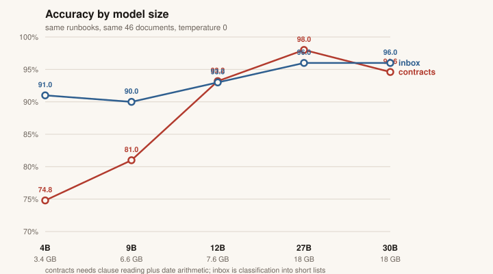
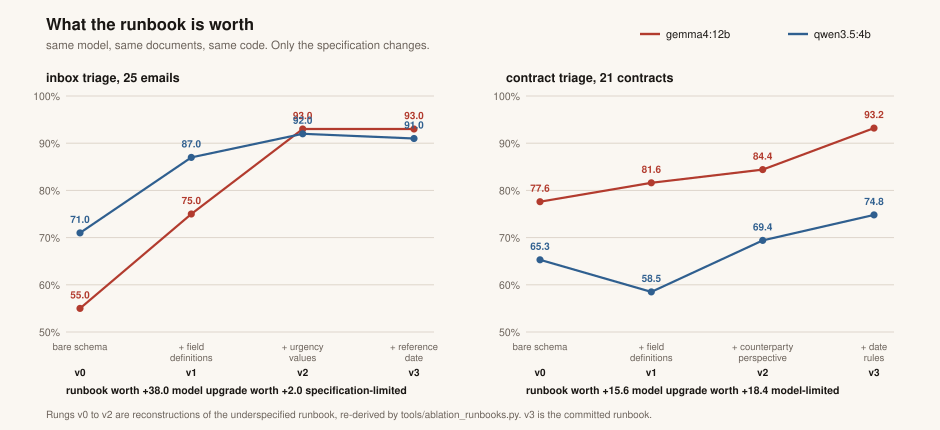
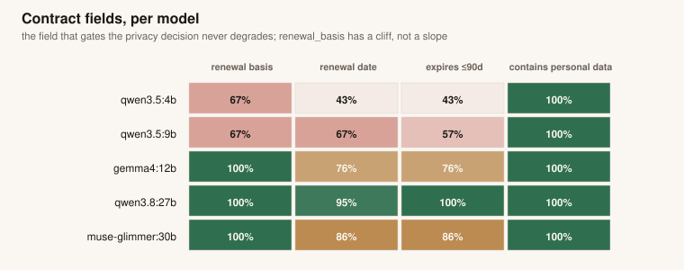
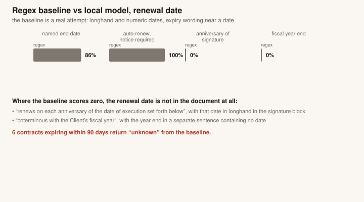
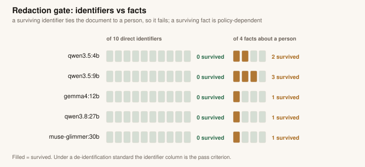

# Understudy: my experiments with local LLMs

A frontier model writes the plan once, online. A small open-weight model does the
work every run, on my machine. This post is the write-up of my experiments to
find out whether that split actually holds up: what I built, what was measured,
and where a small local transformer genuinely earns its keep versus where it
stumbles.

Everything is committed to this repo: the corpus, the runbooks, the run outputs,
the scoring, the charts. No number below was typed from memory; each comes from a
file you can open.

## The idea

Most paperwork in a workplace repeats. The same contracts get read for renewal
dates every quarter. The same inbox gets sorted every morning. The same intake
notes get stripped of personal detail before they go anywhere.

Every one of those runs needs the same judgment calls made before it can start.
Which fields matter. What counts as a valid answer. Whether an email that
complains and asks for a fix is a complaint or a support request. Whether a
sender's own name counts as personal data. What to do when a document is
genuinely ambiguous. Those calls are identical in January and in June, and
getting them right is harder than reading the documents. Sending every document
to a frontier API with the same prompt pays for those calls again on every single
one.

The repo is called **understudy** because that is the job description. An
understudy learns the part once from the lead, then performs it every night
without the lead in the building.

Here, a frontier model authors a **runbook**: the steps, the output schema, the
validation checks, what to do on failure. That happens once and is committed as
JSON. A small local model then executes that runbook over a folder of documents,
supplying the per-document judgment the runbook cannot contain. Reasoning that
happens once lives in the runbook. Reasoning that happens every run happens on
your hardware.

This repo measures both parts. **How much of the accuracy comes from the
runbook?** On inbox sorting, going from a bare output format to a fully written
runbook took the same model from 55% to 93%. **Can a small local model do the work
once it has one?** A 7.6 GB model, the kind that fits a consumer graphics card,
reads 46 documents at 93% against answers checked by hand.

The part I did not expect is that these two do not matter equally. For sorting an
inbox, writing the instructions well beat using a model three times larger, by a
wide margin. For reading a contract, the bigger model won, and better
instructions did not close the gap.

Three concrete outputs come out the other end:

- a **renewal calendar** from 21 contracts, including the ones whose renewal date
  is never written down and has to be computed
- a **routing report** from 25 emails, each assigned an owner, an urgency, and a
  personal-data flag
- a **redaction gate** over whatever either triage flagged, with a deterministic
  scan that checks whether every planted identifier actually got removed

Every model call goes to a local Ollama endpoint on loopback. No document leaves
the machine.

## How we got here

Open-weight local models moved fast enough over the last year or so that it is
worth pausing on. Over roughly twelve months, the useful floor dropped by about
half the parameter count: a 3B to 4B open model released in 2025 matches what a
7B to 8B model did in 2024, on the vendors' own benchmarks. Reasoning traces,
the step-by-step working that used to be a frontier-only trick, arrived in
weights under 4B parameters.

At the same time, the platform vendors quietly shipped local models into
products people already own. Apple runs a roughly 3B-parameter on-device model
behind Apple Intelligence. Google ships Gemini Nano on Android and inside
Chrome, where a web page can call it with no API key. Microsoft ships Phi
Silica on Windows. And Meta's ExecuTorch runtime runs inside Instagram,
WhatsApp, Messenger, and the Ray-Ban glasses, which is probably the largest
deployment of on-device transformers that nobody talks about.

Local is not one thing, either. Local transcription via whisper.cpp is routine
now, and local meeting transcription is a shipping product category. Small
vision models like SmolVLM describe images in under a gigabyte. The New York
Times games team has shown experimental on-device agents inside their word
games, for accessibility and offline play, with the caveats that the work is
experimental and the puzzles themselves are still entirely human-made. Tesco
runs a local code index as one half of a hybrid architecture. And there are
places where local is not a preference but a legal requirement: Jim McQuillan,
who builds software for oncology clinics, runs Llama and Qwen locally via
Ollama because patient data cannot be sent to any cloud model, full stop. He
tells that story on [Runtime Arguments episode 31](https://www.iheart.com/podcast/1333-runtime-arguments-272456389/episode/31-local-llms-good-enough-might-337672656/).

## The honest question

The field is loudly optimistic, so the skeptical question is the right one to
ask: is any of this actually useful, or is it a hobby that happens to compile?
Two videos put that case better than I can summarize, and both are worth your
time: Techno Tim's
["Are Local Models Finally Good Enough?"](https://www.youtube.com/watch?v=K2IGHj7KQoM)
and Cole Medin's
["The HARD Truth About Hosting Your Own LLMs"](https://www.youtube.com/watch?v=EMuBqcO048E).

This repo is my attempt at one measured answer, for one specific shape of job:
narrow, repeated document work with a fixed schema and checkable output. Not a
conversation with a local model. Not an agent wandering the filesystem. Read a
document, produce structured judgment, get scored against ground truth.

## What I built

Three runbooks over a corpus of 46 synthetic documents: 25 emails and 21
contracts, generated deterministically so anyone can reproduce them
byte-identical. Two files hold the answer key: `corpus/TRUTH.json` for scoring
and `corpus/PLANTED.json` for the redaction scan. Neither ever appears in any
prompt, and a model-free validator (`make validate`) asserts that on every run.

Five open models ran the full workload, from four labs, 3.4 GB to 18 GB on
disk. The headline numbers below come from `gemma4:12b` for one reason: it is
the only model in the set that fits in 16 GB of VRAM, which is the bar for
"reproduces on hardware you already own." The larger models score better, and
quoting their numbers as the result would quietly break that claim.

## What was measured

Scored per field against ground truth. `gemma4:12b`: **93.2%** on contract
triage, **93.0%** on inbox triage. The full set:

| model | contracts (21 docs) | inbox (25 docs) |
|---|---|---|
| qwen3.8:27b | 98.0% | 96.0% |
| muse-glimmer:30b | 94.6% | 96.0% |
| gemma4:12b | 93.2% | 93.0% |
| qwen3.5:9b | 81.0% | 90.0% |
| qwen3.5:4b | 74.8% | 91.0% |



The shape of that chart matters more than the ranking. The inbox line is nearly
flat: the smallest model in the set is within five points of the largest. The
contracts line climbs 23 points across the same models.

## "Good enough" is a property of the task, not the model

The clearest single data point: `qwen3.5:4b` scores **91.0%** on inbox triage
and **74.8%** on contract triage. Same model, same run, sixteen points apart.

Inbox triage is classification into short enumerated lists: pick a category,
pick an urgency, pick an owner. Contract triage requires reading a clause,
identifying one of five renewal regimes, then computing a date from a reference
somewhere else in the document. The 4B model handles the first job at a level
that is arguably deployable and the second at a level that clearly is not. Any
sentence of the form "small models are good enough now" is incomplete until it
names the task.

## What the runbook itself is worth

Everything above varies one thing: the model, with the runbook held at its final
version. So it measures what a small model does with a good specification and says
nothing about what the specification was worth. That was the load-bearing claim of
this whole idea and it went unmeasured for two days.

Measuring it means sweeping the other axis. I rebuilt the underspecified runbook
as a four-rung ladder, each rung adding back one named piece of specification, and
ran the ladder across the top and bottom of the model curve. Sixteen runs, same
documents, same code.



Two things fall out of that shape.

**Writing the decisions down was worth 38 points on inbox triage**, taking
`gemma4:12b` from 55.0% with a bare output format to 93.0% with the committed
runbook. No model change, no per-document hints, only definitions of what the
words mean.

**Which half is your bottleneck depends on the task.** Holding the model fixed and
improving the runbook is worth +38.0 on inbox and +15.6 on contracts. Holding the
runbook fixed and upgrading the model is worth +2.0 on inbox and +18.4 on
contracts. Inbox triage is limited by how well you wrote the instructions;
contract triage is limited by the model. For classification, write a better spec.
For interpretation and arithmetic, get a better model.

There is also a warning in the data. `qwen3.5:4b` on contracts scored **6.8 points
below the bare schema** on the rung that introduces a defective date rule,
because it followed the bad instruction faithfully. The 12B partly ignored the
same rule and gained 4 points. A sloppy specification punishes the small model
hardest, which is the practical argument for the runbook being committed,
reviewable text rather than a prompt somebody typed once.

And one correction to my own earlier account. I had credited the inbox recovery to
two fixes: defining the enum values and supplying a reference date. The reference
date turns out to be worth **+0.0** on `gemma4:12b` and **-1.0** on `qwen3.5:4b`,
because `.eml` files carry their own `Date` header and the model already had it. I
had been crediting a fix that did nothing. The full ladder, including the rungs
that go backwards, is in [`docs/FINDINGS.md`](FINDINGS.md).

## Field by field



Two rows stand out.

`renewal_basis`, the classification of which renewal regime a contract uses,
has a cliff rather than a slope: 100% for the top three models, 66.7% for both
qwen3.5 models, and nothing in between.

`contains_personal_data` is 100% on all five models, on both corpora, from
3.4 GB to 18 GB. That happens to be the field that gates the privacy decision:
it determines what enters redaction and therefore what could ever be sent
onward. The one field that never degraded with model size is the one carrying
the most consequence.

One more thing the table shows: every model passed every structural check,
including the 4B scoring 42.9% on `renewal_date`. Ollama's `format` parameter
constrains generation to valid JSON. It does not make the JSON correct. Valid
and correct are different properties, and a pipeline that only checks the first
one is checking almost nothing.

## Could a regex do this?

Fair question, because if patterns get the same result, the model is
decoration. `tools/baseline_regex.py` is a real attempt, not a strawman: it
handles longhand and numeric dates and looks for expiry wording near a date
rather than grabbing the first date in the file.



Overall `renewal_date`: baseline **57.1%**, `gemma4:12b` **76.2%**,
`qwen3.8:27b` **95.2%**. The split underneath is the interesting part. Where
the end date is written in the document, the baseline is competitive: 85.7% on
fixed dates, 100% on auto-renew clauses. Where the date has to be computed, it
scores exactly zero: 0 of 5 on anniversary-of-execution contracts, 0 of 3 on
fiscal-year-end contracts. Six contracts that genuinely expire within 90 days
come back `unknown`. Two examples of why:

> "renews automatically on each anniversary of the date of execution set forth
> below" - with the execution date written in longhand in a signature block
> four paragraphs later

> "coterminous with the Client's fiscal year" - with the fiscal year end stated
> in a separate sentence that contains no date at all

No additional patterns fix that, because it is arithmetic over a reference the
pattern cannot locate. That gap is the work the model is actually doing.

## The redaction gate

Everything either triage flags as containing personal data goes through a
redaction runbook, and then a deterministic scan checks every planted
identifier against every redacted document. The scan gates on **direct
identifiers**: names, addresses, phone numbers, emails, account ids. Facts
about a person (a medical condition, an employment detail) are reported beside
the gate but do not fail it, which is the same line the HIPAA Safe Harbor
de-identification standard draws: identifiers go, substance deliberately
remains, because a de-identified record is useful precisely because the
substance survives.



All five models pass: **0 of 10 planted identifiers survive** on every model.
Two design decisions did most of the work here, and both are about trusting the
model less, not more.

First, the model finds the spans but **code applies them**. Asked to both find
and rewrite, every model reliably substituted short tokens and reliably left
multi-line clauses verbatim while correctly listing them as removals. Finding
an identifying span is judgment and needs a model. Replacing a substring is
not, and does not.

Second, an empty answer is treated as suspicious, not clean. `muse-glimmer:30b`
returned zero removal spans for an HR complaint holding five planted
identifiers, including a child's medical condition, and every structural check
passed, because an empty array is structurally valid. The runner now retries
any flagged document that comes back with no removals, and that retry recovered
the run from three leaked identifiers to none. A redaction pipeline without a
deterministic verifier is a hope, not a control.

## This is not a new idea

Worth saying plainly, because the framing above can read as though I invented
something. I did not, and it is worth being precise about which part is old.

Writing a pipeline down once and then executing it with a cheaper model is
established practice. [DSPy](https://arxiv.org/abs/2310.03714) is the more
automated version: you declare what each step should do, it compiles the prompts
for you, and it reports small open models outperforming ordinary few-shot
prompting once compiled. Understudy is the hand-written case. The runbook is
authored rather than optimised, which is a downgrade in automation and an upgrade
in auditability, because you can open the file that governs the run, read it, and
diff it when it changes.

Two capabilities make the executor side work at all, and both are things I
depended on rather than things I built. **Instruction tuning** is the difference
between a model that continues text and one that follows a specification, and it
is the entire reason a 3.4 GB model can execute a spec written by a 27B one.
**Constrained decoding** is why the output parses: Ollama's `format` parameter
accepts a full JSON Schema, so the model cannot hand back prose where an enum was
required. Neither existed in usable form for local models three years ago, which is
most of why this is buildable now.

It is also worth being clear about what this is **not**, because the vocabulary
overlaps with a research area it does not belong to. There is a body of work on
agent memory, where a system distills its own past execution traces into reusable
procedures and then retrieves and updates them over time. Understudy does none of
that. It has no memory, no retrieval, no update loop, and no traces. The runbook is
an input written before anything runs, not an output produced by running. There is
no loop, no tool selection, and no accumulated state.

So the honest description is unglamorous: a fixed pipeline where one step happens
to be a model call, executed locally, with a privacy gate that is measured rather
than asserted. What is worth reporting is not the architecture. It is the numbers
for how well small models hold up inside it, and which tasks they hold up on.

## Left imperfect on purpose

No prompt was tuned to make a number look better, and the residual failures are
deliberately visible.

The clearest one: on 4 of 5 anniversary-basis contracts, `gemma4:12b` lands
exactly one year past the correct renewal date. It identifies the renewal
regime with 100% accuracy and then gets the multi-year arithmetic wrong. That
is a well-documented shape for small models, classification strong and chained
computation weaker, and those four records are exactly the ones a sensible
pipeline escalates to a person or a bigger model.

Speed and accuracy trade steeply: 28 to 30 tokens per second at 4B, about 5 at
27B. Six times the throughput for roughly 23 points of contract accuracy. That
trade is free for an overnight batch and decisive for anything interactive. And
to be clear about what is not being claimed: local is not faster than cloud.
Total response time is dominated by model size and device compute, and a small
model on modest hardware can be slower end to end than a frontier model over a
good connection. The defensible claims are predictability, availability, and
that repeated runs cost nothing remote.

Every document in the corpus is synthetic. No real person, company, or
agreement appears anywhere in this repository, which is both a privacy
requirement and what makes the results reproducible for anyone who clones it.

Plenty went wrong building this, and the failures were more instructive than
the successes; they are written up separately in [FINDINGS.md](FINDINGS.md).

## Run it yourself

```bash
ollama pull gemma4:12b
make validate    # integrity checks, no model, no network
make all         # contracts, inbox, redact, report
make score       # accuracy against ground truth, per field
```

Python 3.11+ and Ollama are the only requirements. No pip installs, including
for the charts on this page, which are hand-rolled SVG from the standard
library because a chart script needing a pip install would break the repo's own
stdlib-only claim.

These are my experiments, one job shape, one corpus, five models. The numbers
say a small local model handles narrow, repeated, checkable document work at an
accuracy worth taking seriously, provided the plan it executes was written by
something smarter, once.
